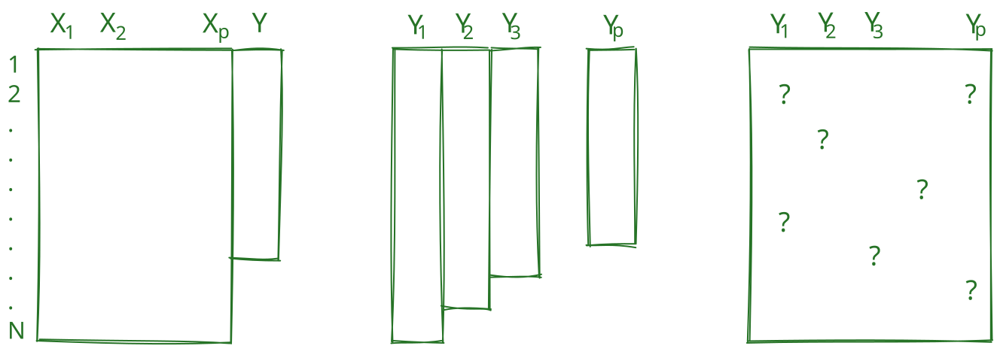



# Die Verteilung fehlender Werte
## Unterscheidung nach Schafer & Graham [-@schafer2002]
Zur Beschriebung der Verteilung fehlender Werte in zweidimensionalen Daten kann zunächst eine Unterscheidung zwischen univariaten, monotonen und arbiträren Mustern (siehe @fig-misspatterstopo) getroffen werden [@schafer2002].

{#fig-misspatterstopo style="width: 90%"}

## Diagnostik der Verteilung fehlender Werte
Univariate, monotone und arbiträre Verteilungen fehlender Werte werden meistens mit Visualisierungen diagnostiziert. Hierzu gibt es verschiedene Möglichkeiten, z.B. die Visualisierung von fehlenden Werten in einem Datensatz mit den Funktionen

* `naniar::vis_miss()`
* `naniar::gg_miss_upset()`
* `Amelia::missmap()`
* `ggmice::plot_pattern()`

### Beispiel: Monotone Verteilung fehlender Werte
```{r}
#| message: false
#| warning: false
library(tibble)
library(naniar)
library(dplyr)
library(ggplot2)
library(brand.yml)
data_monotonemissing <-
  tibble(
    id = 1:100,
    x1 = c(rnorm(25), rep(NA, 75)),
    x2 = c(rnorm(50), rep(NA, 50)),
    x3 = c(rnorm(10), rep(NA, 90))
  ) %>%
  sample_frac(1) # shuffle rows
vis_miss(data_monotonemissing) +
  theme(plot.margin = margin(t = 20, r = 10, b = 10, l = 10)) +
  theme_brand_ggplot2()
```

Hier wird vielleicht nicht auf den ersten Blick deutlich, dass es sich um eine monotone Verteilung handelt, da die fehlenden Werte nicht von links nach rechts zunehmen. Die `vis_miss()`-Funktion hat aber eine `sort_miss`- und `cluster`-Option, die die fehlenden Werte sortiert und damit die monotone Verteilung deutlich macht:

```{r}
vis_miss(data_monotonemissing, sort_miss = TRUE, cluster = TRUE) +
    theme(plot.margin = margin(t = 20, r = 10, b = 10, l = 10)) +
    theme_brand_ggplot2()    
```

## Übung: Missing Verteilung 
::: {.callout}
##  Übung: Plausible Mechanismen 
Im folgenden Codefenster sind drei Objekte `data_misspattern1`, `data_misspattern2` und `data_misspattern3` vorgegeben, die jeweils entweder eine univariate, monotone oder arbiträre Verteilung fehlender Werte aufweisen. Versuchen Sie, die Verteilung fehlender Werte in diesen Datensätzen zu diagnostizieren.
:::


```{webr}
#| exercise: ex_misspattern
#| setup: true
library(dplyr)
library(naniar)
library(Amelia)

data_arbitrarymissing <- 
    tibble(
        id = 1:100,
        x1 = c(100),
        x2 = c(100),
        x3 = c(100)
    ) %>%
    mutate(
        x1 = ifelse(sample(c(TRUE, FALSE), n(), replace = TRUE), x1, NA),
        x2 = ifelse(sample(c(TRUE, FALSE), n(), replace = TRUE), x2, NA),
        x3 = ifelse(sample(c(TRUE, FALSE), n(), replace = TRUE), x3, NA)
    )

data_monotonemissing <- 
    tibble(
        id = 1:100,
        x1 = c(rnorm(50), rep(NA, 50)),
        x2 = c(rnorm(25), rep(NA, 75)),
        x3 = c(rnorm(10), rep(NA, 90))
    )

data_univariatemissing <- 
    tibble(
        id = 1:100,
        x1 = c(rnorm(50), rep(NA, 50)),
        x2 = rnorm(100),
        x3 = rnorm(100)
    )
data_misspattern1 <- data_arbitrarymissing
data_misspattern2 <- data_monotonemissing
data_misspattern3 <- data_univariatemissing
```

```{webr}
#| min-lines: 6	
#| exercise: ex_misspattern


```

::: { .hint exercise="ex_misspattern"}
::: { .callout-note collapse="false"}
## Hinweis 1
`naniar::vis_miss()` ist eine Funktion, die die Verteilung fehlender Werte in einem Datensatz visualisiert. Sie zeigt an, welche Werte fehlen und wie sie sich über die verschiedenen Variablen verteilen.
:::
:::

::: { .hint exercise="ex_misspattern"}
::: { .callout-note collapse="false"}
## Hinweis 2
```r
library(naniar)
vis_miss(data_misspattern1)
```
:::
:::

::: { .solution exercise="ex_misspattern" }
::: { .callout-tip collapse="false"}
## Lösung
`data_misspattern1` weist eine *arbiträre Verteilung* fehlender Werte auf, da die fehlenden Werte zufällig über alle Variablen verteilt sind. `data_misspattern2` zeigt eine *monotone Verteilung*, da die Anzahl der fehlenden Werte von x1 zu x3 zunimmt. `data_misspattern3` hat eine *univariate Verteilung*, da nur in einer Variable (x1) fehlende Werte vorhanden sind.
:::
:::

# Diagnose der Missingness Mechanismen
Im folgenden Codefenster werden die drei Missingness Mechanismen MCAR, MAR und MNAR unter Variation verschiedener weiterer Parameter wie der Stichprobengröße simuliert. 
Anschließend können die Verteilungen dann die Randverteilungen der beobachteten und fehlenden Werte verglichen werden, um die Mechanismen zu diagnostizieren.

## Missing at Random
```{webr}
# Stichprobengröße
N <- 100

data_mar <-
  tibble(
    x = rnorm(N),
    # 0.5 ist die Stärke des Zusammenhangs zwischen x und y_comp
    y_comp = 2 + 0.5 * x + rnorm(N),
    # Die Wahrscheinlichkeit, dass y_beob fehlt, hängt von x ab
    r = rbinom(N, 1, prob = plogis(.2 + 3 * x)),
    y_beob = ifelse(r == 0, y_comp, NA),
    y_mis = ifelse(r == 1, y_comp, NA)
  )

# Plot der randverteilungen von beobachteten und fehlenden Werten
ggplot(data_mar, aes(x = x, y = y_beob)) +
  geom_miss_point() +
  # Regression der beobachteten Werte
  geom_smooth(method = "lm", se = FALSE, color = "#267326") +
  # Regression aller Werte (inkl. fehlende Werte, die hier als NA dargestellt werden)
  geom_smooth(
    aes(y = y_comp),
    method = "lm",
    se = FALSE,
    color = "#267326",
    linetype = "dashed"
  ) +
  # mean(y_comp)
  geom_hline(
    yintercept = mean(data_mar$y_comp, na.rm = TRUE),
    linetype = "dashed",
    color = "#267326"
  ) +
  # mean(y_beob)
  geom_hline(
    yintercept = mean(data_mar$y_beob, na.rm = TRUE),
    color = "#267326"
  ) +
  labs(caption = "Gestrichelte Linie entspricht der »wahren Regression«") +
  theme_minimal()

# Test auf MCAR
mcar_test(data_mar %>% select(y_beob, x))
```


## Missing not at Random
```{webr}
data_mnar <-
  tibble(
    x = rnorm(N),
    # 0.5 ist die Stärke des Zusammenhangs zwischen x und y_comp
    y_comp = 2 + 0.1 * x + rnorm(N),
    # Die Wahrscheinlichkeit, dass y_beob fehlt, hängt von y_comp ab
    r = rbinom(N, 1, prob = plogis(-.5 + .1 * y_comp)),
    y_beob = ifelse(r == 0, y_comp, NA),
    y_mis = ifelse(r == 1, y_comp, NA)
  )


# Plot der randverteilungen von beobachteten und fehlenden Werten
ggplot(data_mnar, aes(x = x, y = y_beob)) +
  geom_miss_point() +
  # Regression der beobachteten Werte
  geom_smooth(method = "lm", se = FALSE, color = "#267326") +
  # Regression aller Werte (inkl. fehlende Werte, die hier als NA dargestellt werden)
  geom_smooth(
    aes(y = y_comp),
    method = "lm",
    se = FALSE,
    color = "#267326",
    linetype = "dashed"
  ) +
  # mean(y_comp)
  geom_hline(
    yintercept = mean(data_mnar$y_comp, na.rm = TRUE),
    linetype = "dashed",
    color = "#267326"
  ) +
  # mean(y_beob)
  geom_hline(
    yintercept = mean(data_mnar$y_beob, na.rm = TRUE),
    color = "#267326"
  ) +
  labs(caption = "Gestrichelte Linie entspricht der »wahren Regression«") +
  theme_minimal()

# Test auf MCAR
mcar_test(data_mnar %>% select(y_beob, x))
```
