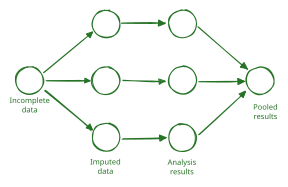



# Überblick
Die multiple Imputation (MI) ist eine sehr mächtige Methode zum Umgang mit fehlenden Werten, die auf der Idee basiert, mehrere plausible Werte für die fehlenden Daten zu generieren. Diese Methode wurde von Rubin [-@rubin1976] entwickelt und hat sich seitdem als eine der Standardmethoden für den Umgang mit fehlenden Daten etabliert. MI besteht aus drei Hauptschritten (siehe @fig-mi-workflow):

1) **Imputation**: In diesem Schritt werden mehrere vollständige Datensätze generiert, indem fehlende Werte durch plausible Werte ersetzt werden. Dies geschieht in der Regel durch die Verwendung von Modellen, die auf den beobachteten Daten basieren, um die fehlenden Werte zu schätzen. Es können verschiedene Imputationsmodelle verwendet werden, z.B. lineare Regression, logistische Regression, ordinale Regression, predictive mean matching oder Random Forests.
2) **Analyse**: Jeder der generierten vollständigen Datensätze wird einzeln analysiert, z.B. durch die Schätzung von Regressionsmodellen, Effektstärken, Hypothesentests.
3) **Pooling**: Die Ergebnisse der Analysen der einzelnen Datensätze werden anschließend zusammengeführt, um eine einzige Schätzung und Inferenzstatistik zu erhalten. Hierzu werden spezielle Pooling-Methoden verwendet, die die Unsicherheit berücksichtigen, die durch die Imputation der fehlenden Werte entsteht.

{#fig-mi-workflow style="width: 90%"}

Im Umfeld des `{mice}`-Packages in R ist zu diesem Workflow auch die folgende Terminologie gebräuchlich geworden:

| Klasse in `{mice}` | Häufiges Objekt Suffix | `{mice}`-Funktion | Beschreibung |
| :--- | :--- | :--- | :--- |
| mids | imp | mice() | Multipel imputierter Datensatz |
| mild | idl | complete() | Liste multipel imputierter Daten |
| mira | fit | with() | Wiederholte Analysen mit multipler Imputation |
| mipo | est | pool() | Pooling der Ergebnisse aus multipler Imputation |

: Terminologie im Umfeld von `{mice}` (siehe @vanbuuren2018)

# Multiple Imputation in `{mice}`
Im oben beschriebenen Workflow ist die multiple Imputation besonders herausfordernd. Sie muss auf die diversen Arten (Skalenniveau, Kontinuität) und Verteilungen von Daten angepasst werden, die Missingness Patterns berücksichtigen und jeweils **alle** Prädiktoren der Missingness enthalten.
Diese Schritte werden im folgenden artifiziellen Minimalbeispiel Schritt für Schritt bearbeitet

# Ein `{mice}`-Minimalbeispiel

## Datengrundlage
Im Minimalbeispiel 
